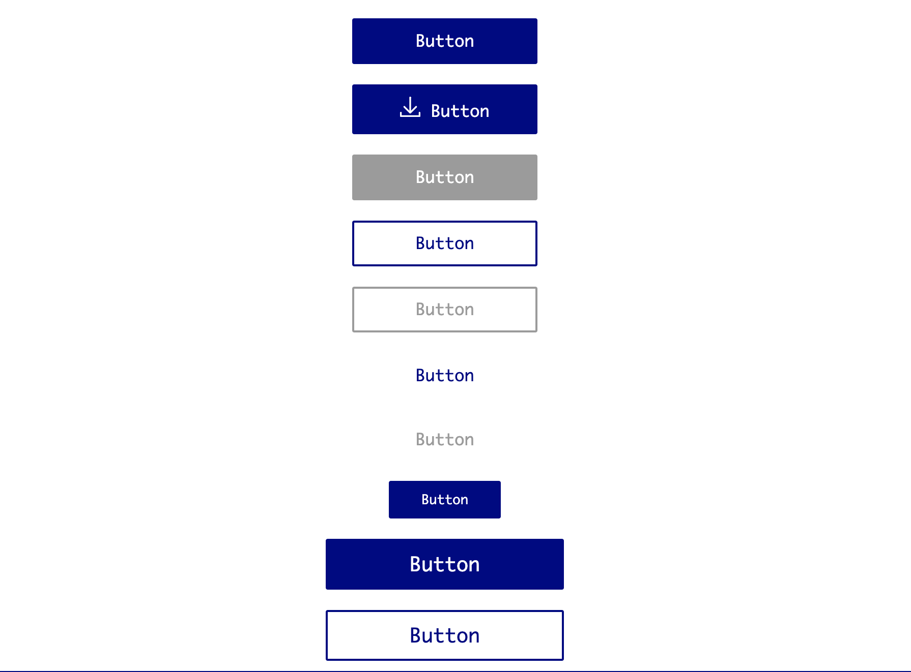

# Button Design System

Using `props` in react you will be creating multiple sets of button on the basis of type, size and color.

## Requirement

Types -
  - primary
  - secondary
  - tertiary

Sizes -
  - small
  - medium
  - large

### Bonus

Theme -
 - light
 - dark

onClickHandler -

Handle the onclick handler on button.

### Example of using the Button component

```jsx
<Button
  size="medium"
  label="Button"
  type="primary"
/>

<Button
  size="small"
  label="Button"
  type="secondary"
/>

<Button
  size="large"
  label="Button"
  type="tertiary"
  onClickHandler={() => alert("You CLicked Me!")}
/>
```

### Demo

